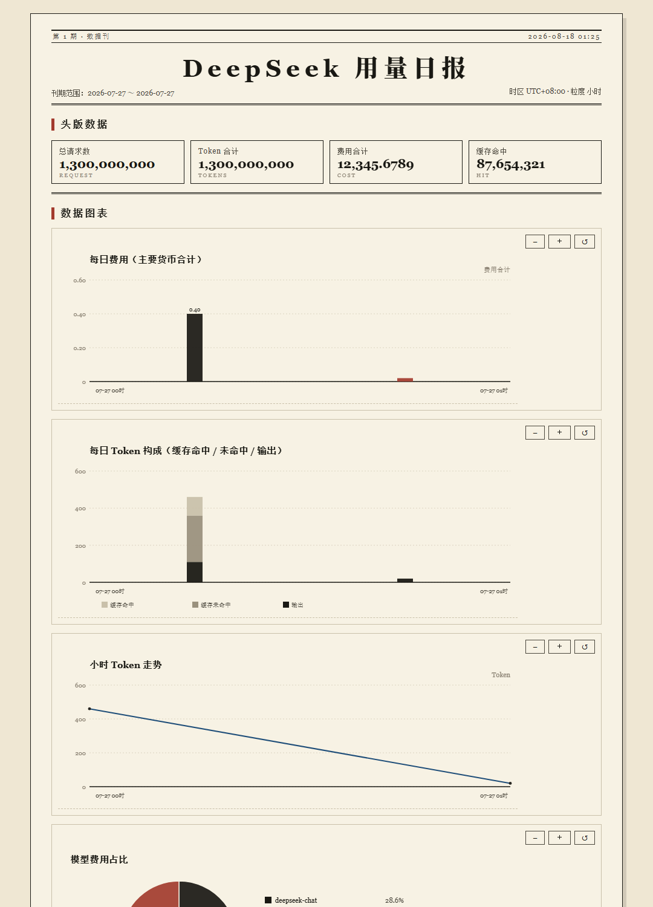
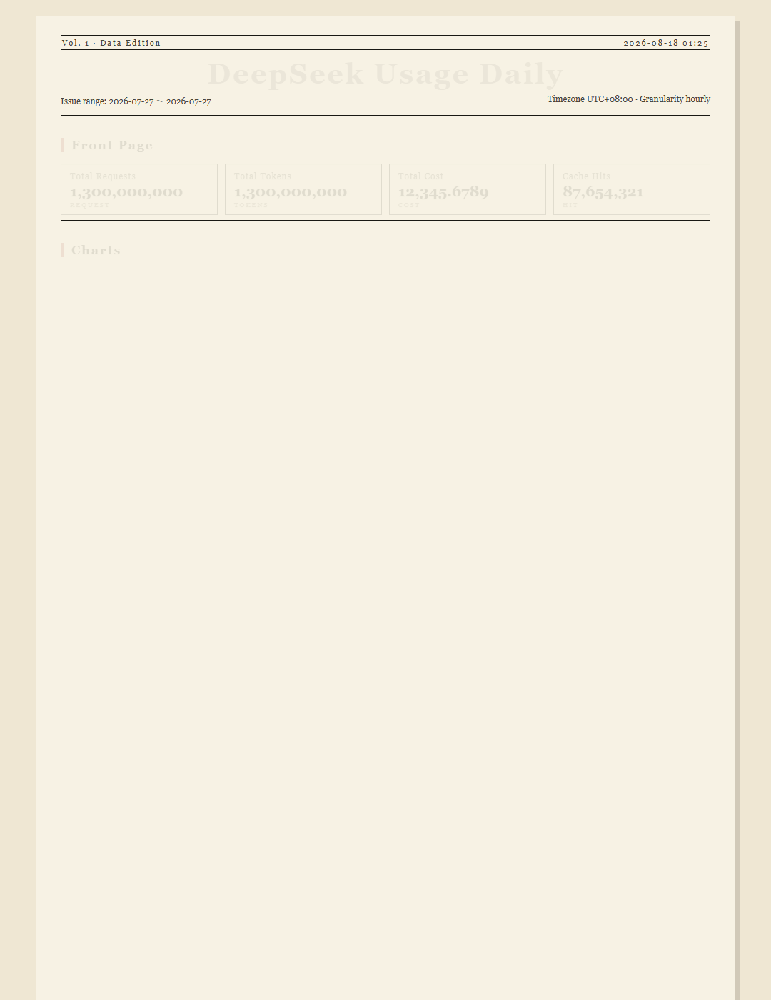
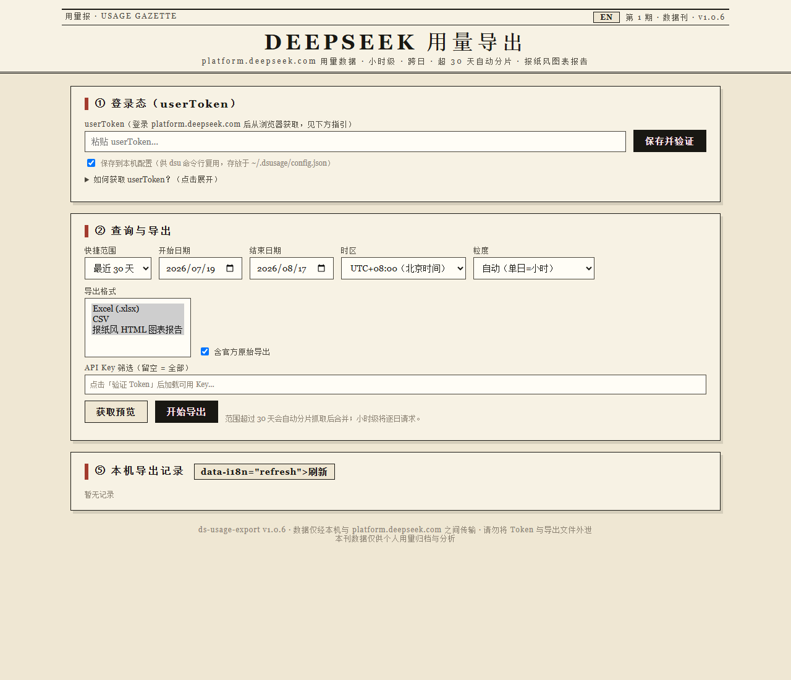

# ds-usage-export（DeepSeek 用量导出工具）v1.0.8

> **English**: [README.en.md](README.en.md)

解决 DeepSeek 开放平台用量后台（https://platform.deepseek.com/usage）的两个痛点：

1. **小时级用量只有选中单个日期才能看到** —— 本工具支持对**任意日期范围**逐日抓取小时桶，合并出连续的小时明细；
2. **后台时间跨度最多 30 天** —— 本工具自动按 ≤30 天窗口分片请求并合并，可导出任意历史周期（逐月、全年）。

用户只需在 platform.deepseek.com **内部登录**（即已在浏览器登录），把登录态 userToken 粘贴进工具
（或保存一次），即可查询、预览并一键导出 **CSV / Excel / 报纸风 HTML 图表报告 / 官方原始数据**。

---

## 功能特性

| 功能 | 说明 |
|---|---|
| 登录态复用 | 读取浏览器 `localStorage['userToken']`（提供控制台一行命令），保存到本机 `~/.dsusage/config.json`，CLI 与 Web 共用 |
| 一键导出 | `dsu go --start X --end Y`：全部格式 + 官方原始数据 + 自动打开 HTML 报告 |
| 报纸风 HTML 报告 | 自包含 `report.html`：报头 + 头版数据（完整数字）+ 内联 SVG 图表（每日费用 / Token 构成 / 小时走势 / 模型占比 / API Key 排名）+ 数据表；图表支持**柱状/折线切换**（默认柱状）、**时间轴滚轮/控件缩放**（带动效）、**悬停与点击钉住**数值提示，报纸编辑部排版 |
| 小时级明细 | `hourly` 粒度：逐日请求（24h 窗口）强制平台返回小时桶，跨天合并为连续小时序列 |
| 多粒度 | `auto`（单日=小时、多日=按服务端粒度）、`hourly`、`daily` |
| 超长周期 | 任意范围自动按 ≤30 天分片抓取，去重合并 |
| 官方原始数据 | 调用平台 `usage/export` 接口下载 ZIP，保留 `amount-*.csv` / `cost-*.csv` 原始文件 |
| 多维度汇总 | 小时明细 / 每日明细 / 每日汇总 / 模型汇总 / API Key 汇总 / 费用明细（多币种） |
| 导出格式 | Excel（多工作表）、CSV（utf-8-sig）、HTML 图表报告、meta.json |
| API Key 筛选 | 按 trackingId 过滤指定 Key |
| 命令行 + Web | `dsu` 子命令与本地 Web 界面（报纸编辑风，http://127.0.0.1:8321）双入口 |
| 多语言 | 中文（默认）/ English：CLI、HTML 报告、Web 界面均支持；自动检测或 `--lang zh\|en` |
| 容错 | 429/5xx 自动退避重试；Token 失效明确提示；`dsu diagnose` 排查平台数据结构 |

## 界面预览

**报纸风 HTML 图表报告**（图表可滚轮/控件缩放、悬停与点击钉住查看数值）





**本地 Web 界面**（报纸编辑风，支持中英文切换）



## 快速开始

### 1. 安装

```bash
pip install -r requirements.txt
# 或完整安装（注册 dsu 命令）
pip install -e .
```

依赖：Python ≥ 3.9，`requests`、`openpyxl`（Excel）、`flask`（Web 界面）。

### 2. 获取登录态 userToken

1. 用 Chrome/Edge 登录 **platform.deepseek.com** 并打开用量页 `/usage`；
2. 按 `F12` → Console，粘贴执行（Token 即复制到剪贴板）：

```js
copy(JSON.parse(localStorage.getItem('userToken')).value)
```

3. 保存到本工具：

```bash
dsu login          # 交互式粘贴（不回显）
# 或一次性传入：
dsu login --token <粘贴的token>
```

> ⚠️ Token 等同登录密码，请勿外泄；本工具仅在本机保存与使用。

### 3. 校验与查询

```bash
dsu check                  # 校验 Token，显示余额
dsu keys                   # 列出 API Key（trackingId / 名称）
dsu --lang en ...          # 强制英文界面（默认自动检测）

# ⭐ 一键导出：Excel+CSV+报纸风HTML报告+官方原始数据，并自动打开报告
dsu go --start 2026-06-01 --end 2026-06-30

# 单日小时级（默认 hourly，同样含 HTML 报告）
dsu day --date 2026-07-01

# 日期范围（默认 auto：单日=小时，多日=服务端粒度）
dsu range --start 2026-06-01 --end 2026-06-30

# 强制小时级（逐日抓取，耗时随天数线性增长）
dsu range --start 2026-06-01 --end 2026-06-30 --granularity hourly

# 全年导出（自动分片，含官方原始 CSV 与 HTML 报告）
dsu go --start 2026-01-01 --end 2026-12-31 --granularity daily

# 指定 API Key / 时区 / 输出目录 / 格式 / 只出 HTML 报告
dsu range --start 2026-06-01 --end 2026-06-30 --api-key <trackingId> \
          --tz +08:00 --format html --out ./my_exports
```

### 4. Web 界面（报纸编辑风）

```bash
dsu serve                 # 默认 http://127.0.0.1:8321
dsu serve --port 9000 --host 127.0.0.1
```

页面内可：粘贴/验证 Token → 选择日期范围与粒度 → 获取预览 → 一键导出（含 HTML 图表报告）→ 下载文件 / 查看历史导出。报头右上角 **EN / 中文** 按钮可切换界面语言。

### 5. Windows 双击启动（免命令行）

项目根目录提供两个批处理，双击即可：

- **`启动Web界面.bat`** —— 自动打开浏览器访问 Web 界面（http://127.0.0.1:8321）
- **`一键导出.bat`** —— 提示输入起止日期（直接回车默认最近 30 天），
  执行 `dsu go` 全量导出并自动打开报纸风报告

## 导出产物

每次导出在输出目录（默认 `./exports/`）下生成一个带时间戳的子目录：

```
dsu_2026-06-01_2026-06-30_UTC+0800_20260701_120000/
├── report.html           # ⭐ 报纸编辑风 HTML 图表报告（双击浏览器打开）
├── usage.xlsx            # Excel：导出信息 / 每日汇总 / 模型汇总 / API Key 汇总 / 费用明细 …
├── hourly_detail.csv     # 小时明细（hourly 粒度时）
├── daily_detail.csv      # 每日×模型×Key 明细
├── daily_summary.csv     # 每日汇总
├── model_summary.csv     # 模型汇总（含费用占比）
├── api_key_summary.csv   # API Key 汇总（含费用占比）
├── cost_detail.csv       # 费用明细（多币种）
├── raw_amount-2026-06-01_2026-06-30.csv   # 官方原始 amount 导出（--include-raw / go）
├── raw_cost-*.csv                          # 官方原始 cost 导出
└── meta.json             # 导出元信息（范围/时区/粒度/汇总/时间）
```

## 目录结构

```
ds-usage-export/
├── dsu.py                # 入口脚本（python dsu.py …）
├── pyproject.toml        # 打包与 dsu 命令
├── requirements.txt
├── 启动Web界面.bat        # Windows 双击启动 Web 界面
├── 一键导出.bat           # Windows 双击一键导出
├── README.md             # 中文文档
├── README.en.md          # English docs
├── dsusage/
│   ├── api.py            # 平台客户端：by_api_key amount/cost、usage/export zip、summary、keys
│   ├── i18n.py           # 多语言（zh/en）
│   ├── parsing.py        # 官方导出 CSV 解析（表头自适应）
│   ├── aggregate.py      # 建表（小时/每日/模型/Key/费用）
│   ├── exporters.py      # xlsx / csv / raw / meta 写出
│   ├── service.py        # 编排：分片抓取、官方原始合并、导出
│   ├── cli.py            # 命令行
│   ├── webapp.py         # Flask Web 界面（报纸编辑风）
│   ├── report.py         # 报纸风 HTML 图表报告生成器（内联 SVG + 悬停提示 + 动效）
│   └── web/static/index.html
├── examples/report_demo.html   # 合成数据生成的示例报告
├── tests/                # 单元测试（合成数据，无需真实 Token）
└── docs/
    ├── api-notes.md      # 平台内部 API 调研笔记
    └── 获取Token.md       # 三种获取 userToken 的方式
```

## 开发与测试

```bash
python -m unittest discover -s tests -v
```

测试使用合成数据，不依赖真实账号。

## 原理简述

平台用量页前端对单日范围调用
`/api/v0/usage/by_api_key/amount|cost?start=&end=&tz=`，返回 `bucket=3600` 的小时桶；
对多日范围返回 `bucket=86400` 的天桶；日期跨度限制（30 天）仅存在于前端。
因此本工具逐日请求获得小时桶并跨日合并，对超长范围按 30 天分片。
详见 `docs/api-notes.md`。

## 版本历史

- **v1.0.8**（当前）：入场动画只在首次打开播放，缩放/拖拽仅平滑过渡。\n- **v1.0.7**：图表**柱/线可切换**（默认柱状）、**时间轴横向放大**（细柱→放大变粗、自动分桶）、**点击钉住**提示；示例报告升级为 24 小时数据。\n- **v1.0.6**：图表滚轮改为**缩放**（鼠标锚点、带动效）+ 控件放大/缩小/复位 + 缩放后拖拽平移；
  README 添加实例截图；版本 tag 1.0.6。
- **v1.0.5**：图表滚轮横滑 + 点击钉住数值提示；新增内部开发文档 DEVELOPMENT.md（仅本地，不上传）；
  版本 tag 1.0.5。
- **v1.0.4**：多语言（中文/English，CLI + HTML 报告 + Web 界面）；修复 Web 服务
  favicon/404 错误刷屏；版本 tag 1.0.4。
- **v1.0.3**：完整数字显示（不缩写）、图表悬停提示、报带动效；版本 tag 1.0.3。
- **v1.0.2**：一键导出 `dsu go`、报纸编辑风 HTML 图表报告、Web 界面报纸风改版、
  `api_key` 对象结构兼容修复。详见 [CHANGELOG.md](CHANGELOG.md)。
- **v1.0.1**：首版：登录态复用、小时/日/多维度查询、CSV/Excel/官方原始导出、
  超 30 天自动分片、API Key 筛选、CLI + Web 双入口。

## 免责声明

本工具仅封装 platform.deepseek.com 已公开的 Web 内部接口，仅供个人用量数据备份与分析使用；
请遵守 DeepSeek 平台服务条款，控制请求频率，勿用于商业转售或滥用。
